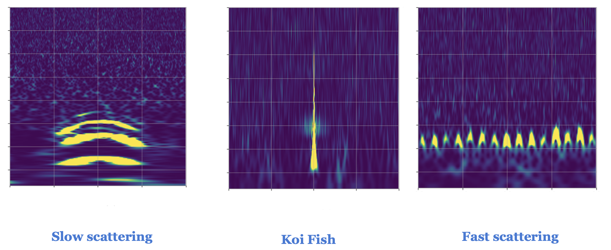

# slow_fast_koi

Short duration bursts of energy, also knoown as **glitches** or **triggers**, often show up as noise in the `Advanced LIGO detectors`. These detectors in Livingston, Louisiana and Hanford, Washington in USA detected gravitional waves for the first time in 2015, which led to the 2017 Nobel prize in Physics. You can find more about LIGO at [here](https://www.ligo.org)

In this project, I am using Convolutional Neural Network (CNN) to classify three different types of glitches that very regularly show up in the detector. The algorithm is trained on time-frequency spectrogram images of the three glitch classes as shown here.

The script `make_qscans.py` was used to generate these time-frequency spectrogram images from the raw timeseries, I then separated these images into **Training** and **Validation** using the script `transfer_files.py`. The code for this noise classification is in the file `classify_noise.py`. 
The details of the CNN model is in the file `fast_slow_koi.h5` while loss and accuracy parameters are stored in `history.pkl`. 
